# 计算机网络 第三次课程报告

2151769 吕博文

## 以太网MAC帧

#### 以太网 MAC 帧简介

以太网帧是在以太网链路上传输的数据单元，属于 OSI 七层模型的第二层（数据链路层）。

常见的以太网帧格式有两种，一种是 Ethernet II 格式，另一种是 IEEE 802.3 格式。在现代网络中，绝大多数数据帧使用的是 Ethernet II 格式。本次实验中抓取到的帧也是 Ethernet II 格式。

Ethernet II 和 IEEE 802.3 格式的主要区别在于，Ethernet II 帧包含一个两字节的类型字段，而 IEEE 802.3 格式的相同位置则是长度字段。Ethernet II 的类型字段用于指示以太网首部后跟随的数据包类型，例如 0x0800 表示 IP 协议包，0x0806 表示 ARP 协议包。IEEE 802.3 格式中，长度字段用于表示数据字段的字节长度。

以下是一个 Ethernet II 帧的基本结构：

* 目的 MAC 地址（6 字节）
* 源 MAC 地址（6 字节）
* 类型字段（2 字节）
* 数据字段（46 到 1500 字节）
* 帧校验序列（FCS）（4 字节）、
  
类型字段是 Ethernet II 帧的关键部分，确保接收设备能够正确解析后续数据的协议类型。这种设计使得 Ethernet II 帧广泛应用于现代网络通信中。

下图是 Ethernet II 包具体结构。

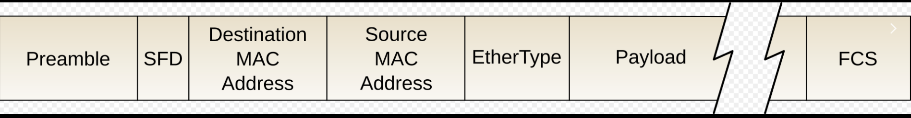


### 实验环境

本地电脑没有通过以太网连接其他设备，一时无法搭建真实的实验环境，所以这部分使用 Windows 系统的 Linux 子系统（WSL2）与 Windows 宿主机的虚拟以太网连接来完成实验。

先在两台设备上查看各自的网卡信息：

#### Windows

```
C:\Users\14864>ipconfig /all

Windows IP 配置

...（其他接口略）

以太网适配器 vEthernet (WSL (Hyper-V firewall)):

   连接特定的 DNS 后缀 . . . . . . . :
   描述. . . . . . . . . . . . . . . : Hyper-V Virtual Ethernet Adapter
   物理地址. . . . . . . . . . . . . : 00-15-5D-3B-C9-82
   DHCP 已启用 . . . . . . . . . . . : 否
   自动配置已启用. . . . . . . . . . : 是
   本地链接 IPv6 地址. . . . . . . . : fe80::d3d4:c5f8:53fa:49e7%56(首选)
   IPv4 地址 . . . . . . . . . . . . : 172.20.192.1(首选)
   子网掩码  . . . . . . . . . . . . : 255.255.240.0
   默认网关. . . . . . . . . . . . . :
   DHCPv6 IAID . . . . . . . . . . . : 939529565
   DHCPv6 客户端 DUID  . . . . . . . : 00-01-00-01-2B-88-0C-EF-C8-7F-54-CB-6A-CD
   TCPIP 上的 NetBIOS  . . . . . . . : 已启用
```

这里的物理地址也就是该接口的 MAC 地址：`00-15-5D-3B-C9-82`

#### Linux 虚拟机

```
extreme1228@LAPTOP1228:~$ ip addr
1: lo: <LOOPBACK,UP,LOWER_UP> mtu 65536 qdisc noqueue state UNKNOWN group default qlen 1000
    link/loopback 00:00:00:00:00:00 brd 00:00:00:00:00:00
    inet 127.0.0.1/8 scope host lo
       valid_lft forever preferred_lft forever
    inet 10.255.255.254/32 brd 10.255.255.254 scope global lo
       valid_lft forever preferred_lft forever
    inet6 ::1/128 scope host
       valid_lft forever preferred_lft forever
2: eth0: <BROADCAST,MULTICAST,UP,LOWER_UP> mtu 1400 qdisc mq state UP group default qlen 1000
    link/ether 00:15:5d:36:9d:ff brd ff:ff:ff:ff:ff:ff
    inet 172.20.196.168/20 brd 172.20.207.255 scope global eth0
       valid_lft forever preferred_lft forever
    inet6 fe80::215:5dff:fe36:9dff/64 scope link
       valid_lft forever preferred_lft forever
```

该接口 MAC 地址为：`00:15:5d:36:9d:ff`

### 抓包分析以太网 MAC 帧

根据以上信息，我们只需要抓取本机（`00-15-5D-3B-C9-82`）和虚拟机（`00:15:5d:36:9d:ff`）之间的网络包进行分析即可。

由于主机和虚拟机之间的虚拟网络中没有其他设备，所以我们暂时不需要设置过滤器来筛选发给虚拟机的报文。

在 Wireshark 软件中，将抓包的接口设置为 以太网适配器 vEthernet (WSL)，然后向虚拟机发送一个网络请求（例如发送 ICMP Ping 请求），查看 Wireshark 抓取到的报文。

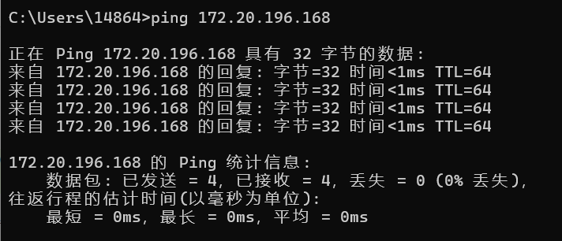

我们在Wireshark软件中设置筛选规则为`icmp`进行筛选，结果如下：
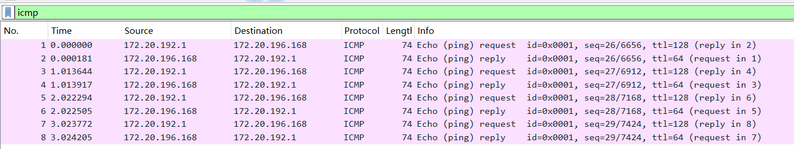

可以看到在 Wireshark 软件中已经抓到了 ICMP Ping 的若干个请求和回复。我们选取第一个`icmp`  请求来分析：

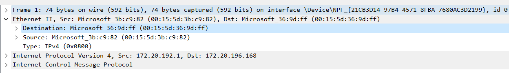

这里的 `Ethernet II, Src: Microsoft_3b:c9:82 (00:15:5d:3b:c9:82), Dst: Microsoft_36:9d:ff (00:15:5d:36:9d:ff)` 就是我们要分析的以太网 MAC 帧。

`Ethernet II` 指的是这个包是 Ethernet II 格式。

二进制信息如下：

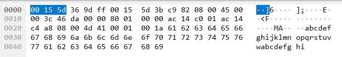

在 Wireshark 中点击左侧的 Ethernet II 帧，右边会显示该帧的原始数据，并自动高亮相应的部分。

通过观察高亮部分，我们首先注意到上面帧格式图片中的 4 字节校验部分消失了。这是因为网卡已经使用校验码对包的正确性进行了校验，Wireshark 抓到的是已经去掉校验码的包。

我们可以清晰地看到 Ethernet II 帧首部中按顺序包含了目标地址（`00:15:5d:36:9d:ff`）、源地址（`00:15:5d:3b:c9:82`）以及数据包类型（`0x0800` 表示 IP 协议）。

接下来的部分就是上层传输的数据包。至此，以太网 MAC 帧分析部分结束。

## 无线局域网 MAC 帧

### 无线局域网 MAC 帧简介

无线局域网（WLAN） MAC 帧是无线网络中用于传输数据的基本单位，遵循 IEEE 802.11 标准。WLAN MAC 帧的结构相较于以太网帧更加复杂，因为它需要支持无线通信的独特需求，如移动性、加密和管理功能。

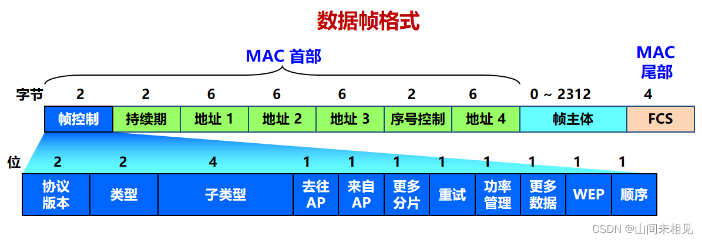

### 无线局域网 MAC 帧主要分为三类：

管理帧（Management Frames）：用于建立和维护无线连接。常见的管理帧包括：

* Beacon 帧：用于同步网络时间，提供网络的存在信息。
* Probe 请求/响应帧：用于设备搜索和连接到无线网络。
* Association 请求/响应帧：用于设备与接入点的关联过程。
* 
控制帧（Control Frames）：用于辅助数据传输过程。常见的控制帧包括：

* RTS（Request to Send）帧：发送数据前的请求信号。
* CTS（Clear to Send）帧：应答 RTS 信号，允许发送数据。
* ACK（Acknowledgement）帧：确认接收到的数据帧。
* 
数据帧（Data Frames）：用于传输数据，包含实际的用户数据。


### 实验过程

结合网上资料与实验，Windows系统下的网卡打开监控模式之后Wireshark依然成功无法抓取WiFi数据包，故选用Microsoft Network Minitor 进行实验

如下图所示，管理员方式打开Microsoft Network Minitor软件之后，选中所支持的`WlAN`类型，点击`capture`进行抓包，`start`开始抓包，可以观察到软件抓包结果如下：
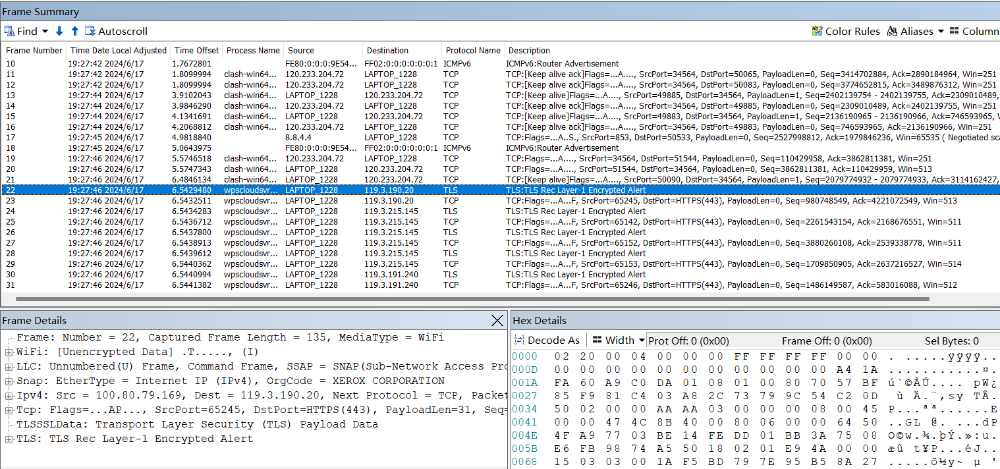

我们选取使用WPS软件的一次包请求进行具体分析
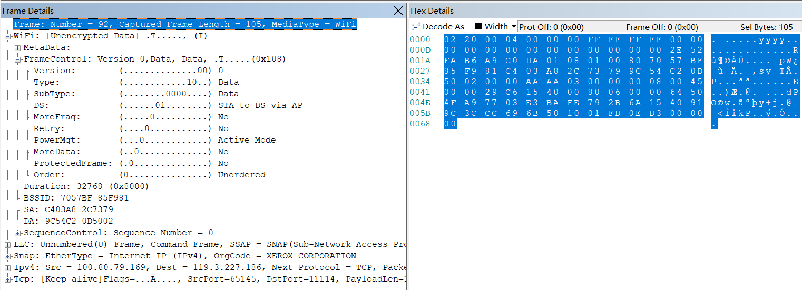

- 协议版本：`0`
- 类型：`10` 即数据。
- 子类型：`0000` 还是数据。
- `ToDS` 和 `FromDS` ：`10` 这里表示从分布式系统（DS，其实就是 WLAN）发往站点（STA，其实就是我们的电脑），即这个包是互联网上发给我们主机的包。通过观察下面地址字段的硬件地址可以得知确实如此。

我的电脑的 WLAN 接口的信息：

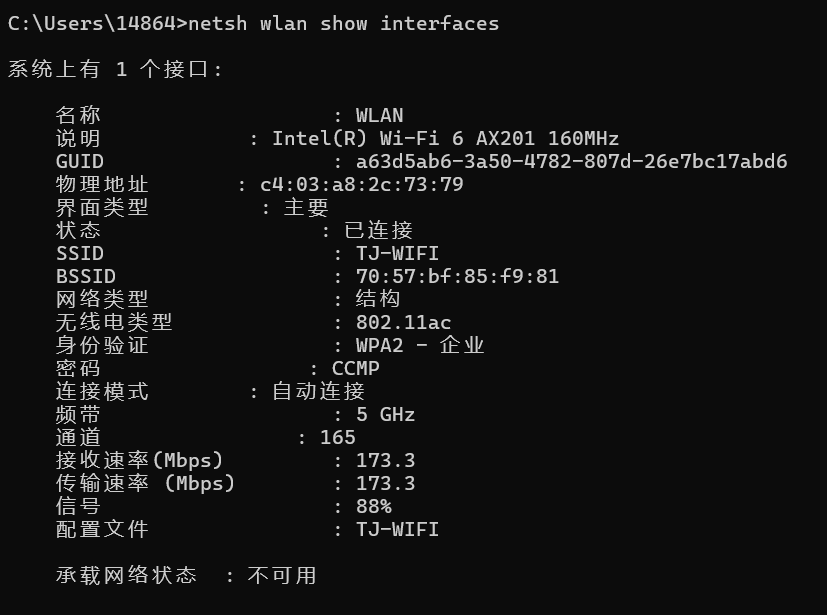

- 更多片段：`0` 这个包是整个发送而不是分片发送的。
- 重试：`0` 没有重试。
- 电源管理：`0` 不在省电模式。
- 更多数据：`0`
- 受保护帧：`1` 同济大学校园 WIFI （TJ-WIFI）确实是加密网络。
- 顺序：`0`

地址字段：

- DA ：通过对比上面的信息，确实是本机的 MAC 地址。
- BSSID ：通过对比上面的信息，确实是无线网络的 BSSID 。
- SA ：应该是给我们发送报文的主机的 MAC 地址，这个无法验证了。

头部的其余字段：

- 顺序控制字段：分片号为 `0000` ，刚好对应上面数据没有被分片。下面的序列号通过对比抓到的前后数据包，确实是按顺序增长的。

## IP 协议

### IP 协议简介

IP（Internet Protocol，互联网协议）是互联网的核心协议之一，负责在不同网络之间传输数据包。IP 协议的主要功能是将数据包从源设备传输到目的设备，并确保数据能够在网络中正确路由和到达。

### IP 协议的基本特征：
#### 无连接性：
IP 协议是无连接的协议，这意味着在数据传输过程中，不需要建立连接。每个数据包独立传输，网络中的每个数据包都被视为一个单独的消息。

#### 面向数据报：
IP 协议基于数据报交换方式，即每个数据包（数据报）都包含完整的信息，能够独立进行路由和传输。

#### 分段与重组：
由于网络中的最大传输单元（MTU）可能不同，IP 协议支持将较大的数据包分割成较小的数据段在网络中传输，并在目的地进行重组。

#### 路由选择：
IP 协议使用路由器在网络中传递数据包，通过路由选择算法确定数据包的最佳路径，确保数据能够到达目标设备。


### IP 协议的版本：
#### IPv4（Internet Protocol version 4）：

* 地址长度：32位。
* 地址范围：从 0.0.0.0 到 255.255.255.255。
* 地址分类：包括A类、B类、C类地址等。
* 报头结构：包含版本号、头部长度、服务类型、总长度、标识符、标志、片偏移、生存时间（TTL）、协议类型、头部校验和、源IP地址、目的IP地址等字段。
#### IPv6（Internet Protocol version 6）：

#### 地址长度：128位。
* 地址范围：从 2000::/3 到 ffff:ffff:ffff:ffff:ffff:ffff:ffff:ffff。
* 地址简化：使用冒号分隔的十六进制数，支持压缩表示法。
* 改进特性：包括更大的地址空间、更高的安全性（IPsec）、简化的首部结构、支持自动配置和移动性等。

### IP 协议的报头结构（IPv4 示例）：
IPv4 数据包的报头结构包含多个字段，以下是一些关键字段的简要说明
```
0  0  0  0  0  0  0  0  0  0  0  0  0  0  0  0
+-+-+-+-+-+-+-+-+-+-+-+-+-+-+-+-+-+-+-+-+-+-+-+-+-+-+-+-+-+-+-+-+
| 版本（Version）  |  头部长度（IHL）  | 服务类型（Type of Service）  |
+-+-+-+-+-+-+-+-+-+-+-+-+-+-+-+-+-+-+-+-+-+-+-+-+-+-+-+-+-+-+-+-+
|          总长度（Total Length）         |
+-+-+-+-+-+-+-+-+-+-+-+-+-+-+-+-+-+-+-+-+-+-+-+-+-+-+-+-+-+-+-+-+
|      标识符（Identification）      |  标志（Flags） |  片偏移（Fragment Offset） |
+-+-+-+-+-+-+-+-+-+-+-+-+-+-+-+-+-+-+-+-+-+-+-+-+-+-+-+-+-+-+-+-+
|  生存时间（Time to Live）  |    协议（Protocol）    |  头部校验和（Header Checksum）  |
+-+-+-+-+-+-+-+-+-+-+-+-+-+-+-+-+-+-+-+-+-+-+-+-+-+-+-+-+-+-+-+-+
|                  源 IP 地址（Source Address）                   |
+-+-+-+-+-+-+-+-+-+-+-+-+-+-+-+-+-+-+-+-+-+-+-+-+-+-+-+-+-+-+-+-+
|                目的 IP 地址（Destination Address）               |
+-+-+-+-+-+-+-+-+-+-+-+-+-+-+-+-+-+-+-+-+-+-+-+-+-+-+-+-+-+-+-+-+

```

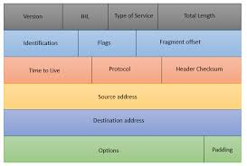

### 实验环境

使用前文以太网部分搭建的虚拟实验环境进行实验。主机和虚拟机通过虚拟以太网连接。

先在两台设备上查看各自的网卡信息：

#### Windows

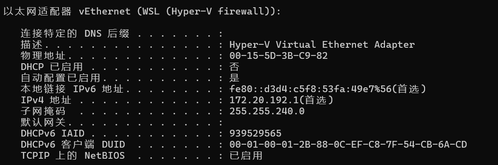
该接口的 IPv4 地址：`172.20.192.1`

#### Linux 虚拟机(Ubuntu)

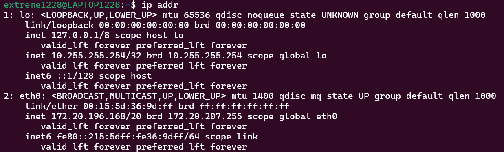

该接口 IPv4 地址为：`172.20.196.168`

#### HTTP 服务器搭建

我们使用 Python 的 Flask 框架搭建一个简单的 HTTP 服务器。

```py3
from flask import Flask, jsonify
from flask_cors import CORS
import logging

# 创建 Flask 应用实例
app = Flask(__name__)

# 启用跨域资源共享 (CORS)
CORS(app)

# 配置日志
logging.basicConfig(level=logging.INFO)

@app.route("/get_test", methods=["GET"])
def get_test():
    app.logger.info("GET request received at /get_test")
    return jsonify({"msg": "GET Success"}), 200

@app.route("/health", methods=["GET"])
def health_check():
    app.logger.info("Health check requested")
    return jsonify({"status": "healthy"}), 200

@app.errorhandler(404)
def not_found(error):
    app.logger.warning(f"404 error: {error}")
    return jsonify({"error": "Not Found"}), 404

@app.errorhandler(500)
def internal_error(error):
    app.logger.error(f"500 error: {error}")
    return jsonify({"error": "Internal Server Error"}), 500

if __name__ == "__main__":
    app.run(host="0.0.0.0", port=4500, debug=True)

```

该 HTTP 服务器监听 `4500` 号端口，当收到 `GET /get_test` 请求时返回 `200 Success` 和一个 JSON 数据。

我们将该程序部署在`Ubuntu`系统上运行
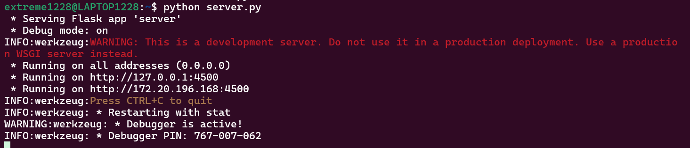


接下来三个部分的实验都在该环境下完成。

### 实验过程

从 Windows 主机向虚拟机发送一个 IP 协议的请求，这里发送的是 HTTP GET 请求（以下三个部分发送的都是同一个这个请求）。

```
C:\Users\14864>curl http://172.20.196.168:4500/get_test -v
```

查看 Wireshark ，发现抓到了许多包。

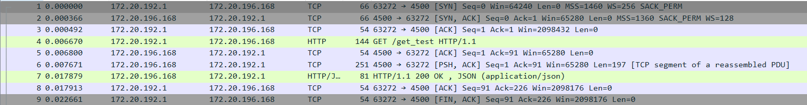

选择第一个包进行分析。

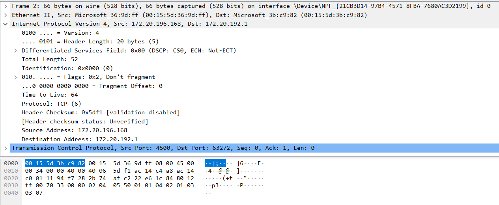

结合前文 IPv4 首部结构图，可以找到该数据包中与之一一对应的部分。

- 版本（Version） `4` 我们发送数据包确实使用 IPv4 。

- 首部长度（Internet Header Length，IHL） 5 ∗ 4 = 20 字节。

- 差分服务代码点（Differentiated Services Code Point，DSCP）默认。

- 显式拥塞通告（Explicit Congestion Notification，ECN）无。

- 全长（Total Length）52 。

- 标识符（Identification）0x0000 。

- 标志（Flags）`010` 表示不分片，根据上面的全长得知这个数据包很小，确实不需要分片发送。

- 分片偏移（Fragment Offset）`0` 没有分片自然没有分片偏移。

- 存活时间（Time To Live，TTL） 64 。

- 协议（Protocol） TCP 。

- 首部检验和（Header Checksum） 0x5df1 不校验 。

IPv4 地址是使用 32 位整数存储的。（在 IP 协议部分的末尾，源地址 `172.20.196.168（ac 14 c4 a8）` ，目标地址 `172.20.192.1（ac 14 c0 01）`）

## TCP 协议

### TCP 协议简介

TCP 是一种面向连接的、可靠的传输层协议，位于 OSI 模型的第四层。它通过建立连接、序列号、确认应答、流量控制和错误检测等机制，提供可靠的端到端字节流传输服务。TCP 广泛应用于需要高可靠性的数据传输的场景，如网页浏览、文件传输、电子邮件等。

#### TCP 报文格式
TCP 报文由多个字段组成，每个字段都承担特定的功能。以下是 TCP 报文的结构及各字段的详细说明：
```
  0                   1                   2                   3  
  0 1 2 3 4 5 6 7 8 9 0 1 2 3 4 5 6 7 8 9 0 1 2 3 4 5 6 7 8 9 0 1
 +-+-+-+-+-+-+-+-+-+-+-+-+-+-+-+-+-+-+-+-+-+-+-+-+-+-+-+-+-+-+-+-+
 |          Source Port          |       Destination Port        |
 +-+-+-+-+-+-+-+-+-+-+-+-+-+-+-+-+-+-+-+-+-+-+-+-+-+-+-+-+-+-+-+-+
 |                        Sequence Number                        |
 +-+-+-+-+-+-+-+-+-+-+-+-+-+-+-+-+-+-+-+-+-+-+-+-+-+-+-+-+-+-+-+-+
 |                    Acknowledgment Number                      |
 +-+-+-+-+-+-+-+-+-+-+-+-+-+-+-+-+-+-+-+-+-+-+-+-+-+-+-+-+-+-+-+-+
 |  Data |Rese- |C|E|U|A|P|R|S|F|                               |
 | Offset|rved  |W|C|R|C|S|S|Y|I|            Window             |
 |       |      |R|E|G|K|H|T|N|N|                               |
 +-+-+-+-+-+-+-+-+-+-+-+-+-+-+-+-+-+-+-+-+-+-+-+-+-+-+-+-+-+-+-+-+
 |           Checksum            |         Urgent Pointer        |
 +-+-+-+-+-+-+-+-+-+-+-+-+-+-+-+-+-+-+-+-+-+-+-+-+-+-+-+-+-+-+-+-+
 |                    Options                    |    Padding    |
 +-+-+-+-+-+-+-+-+-+-+-+-+-+-+-+-+-+-+-+-+-+-+-+-+-+-+-+-+-+-+-+-+
 |                             Data                              |
 +-+-+-+-+-+-+-+-+-+-+-+-+-+-+-+-+-+-+-+-+-+-+-+-+-+-+-+-+-+-+-+-+

```
#### TCP 报文字段说明
* 源端口号（Source Port）（16 位）：发送方的端口号。
* 目的端口号（Destination Port）（16 位）：接收方的端口号。
* 序列号（Sequence Number）（32 位）：数据段的序列号，用于保证数据包按顺序接收。
* 确认号（Acknowledgment Number）（32 位）：确认已收到数据的下一个字节的序列号。
* 数据偏移（Data Offset）（4 位）：表示 TCP 报文头部的长度，以 32 位字为单位。
* 保留位（Reserved）（3 位）：保留为将来使用，通常为 0。
* 控制位（Flags）（9 位）：包含多个控制标志，每个标志代表特定的控制信息。
* URG（Urgent）：紧急指针有效。
* ACK（Acknowledgment）：确认号有效。
* PSH（Push）：提示接收方将数据尽快传递给应用层。
* RST（Reset）：重置连接。
* SYN（Synchronize）：同步序列号以建立连接。
* FIN（Finish）：表示发送方完成发送任务。
* 窗口大小（Window Size）（16 位）：接收窗口大小，表示接收方能够接收的数据量，用于流量控制。
* 校验和（Checksum）（16 位）：对整个 TCP 报文进行校验，确保数据完整性。
* 紧急指针（Urgent Pointer）（16 位）：指示紧急数据的末尾，只有当 URG 标志置位时才有效。
* 选项（Options）（可变长度）：用于支持扩展功能，如窗口大小扩展、时间戳等。
* 填充（Padding）：用于保证 TCP 头部长度是 32 位的整数倍。
* 数据（Data）：实际传输的数据。

#### TCP 报文功能
##### 连接管理：

* 三次握手：用于建立连接。过程包括 SYN、SYN-ACK 和 ACK 三个步骤。
* 四次挥手：用于断开连接。过程包括 FIN、ACK、FIN 和 ACK 四个步骤。
##### 数据传输：

TCP 使用序列号和确认号保证数据的顺序和完整性。
通过滑动窗口机制进行流量控制，防止发送方发送数据过快而接收方处理不过来。
##### 错误检测：

通过校验和字段检测数据传输中的错误，保证数据的完整性。
##### 拥塞控制：

使用慢启动、拥塞避免、快速重传和快速恢复等算法，动态调整数据传输速率，防止网络拥塞。
### 实验环境

和上面 IP 协议和以太网部分相同。

### 实验过程

这里 TCP 协议作为 HTTP 的下层协议。

通过在 Wireshark 中配置过滤条件 `tcp` 来筛选出使用的包。

这些组成了 TCP 连接三次握手的过程。四次挥手其实也抓到了，但是从图上看不出来。需要查看数据包具体内容。

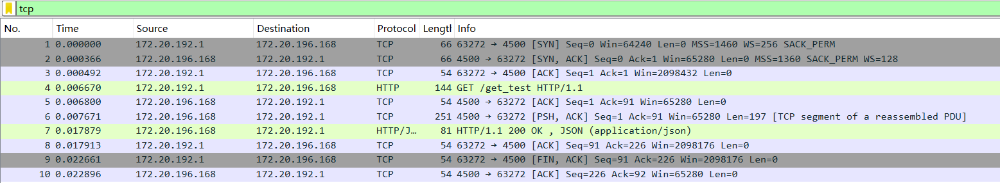

#### 三次握手

可以看到本机先向目标主机发送 SYN ，目标主机回复 SYN ACK ，本机回复 ACK 之后连接建立，开始传送 HTTP 数据。

#### 四次挥手

四次挥手过程从目标主机发送 HTTP Response 时就开始了，如下图所示：

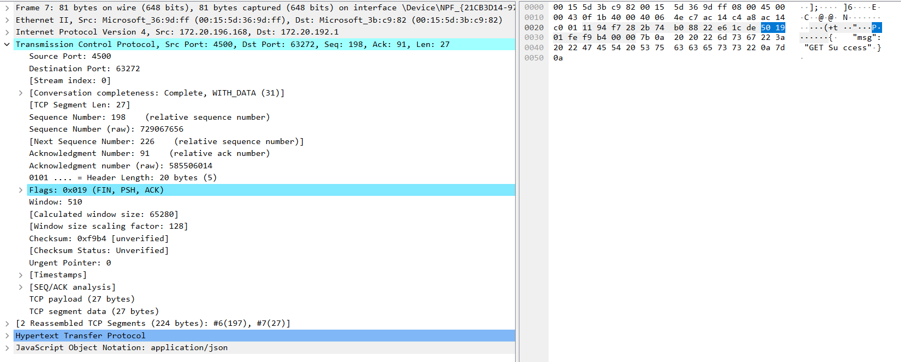

服务器在发送 HTTP 回复时就决定结束连接。之后本机回复 ACK 和 FIN ACK ，目标主机回复 ACK ，连接正式关闭。

#### TCP 报文具体内容

以上面 HTTP Response 中的 TCP 报文为例。

- 源端口（16 位） `4500` 确实时我们服务器程序设置的端口
- 目的地端口（16 位） `63272` 应该是主机用于和服务器进行 HTTP 通信的端口。
- 序列号（32 位） `198` 这是相对值，Wireshark 帮我们计算好了。
- 确认号（32 位） `91` 这也是相对值，Wireshark 帮我们计算好了。
- 数据偏移（4 位） `5`
- 保留（3 位） `000`
- 标志（9 位） ：

  - ACK（1 位）：`1`
  - PSH（1 位）：`1`
  - FIN（1 位）：`1` 服务器想要结束连接。

- 窗口大小（16 位） `510`
- 校验和（16 位） `0xf9b4`

## HTTP 协议

### HTTP 协议简介
HTTP 是一种用于分布式、协作式和超媒体信息系统的应用层协议。它是万维网的数据通信基础，通过它客户端（通常是浏览器）与服务器进行通信，传输网页内容。HTTP 协议基于请求-响应模型，通常运行在 TCP 之上。

### HTTP 的基本特征：
#### 无连接：
每一次请求和响应都在独立的连接中完成。客户端发送请求后，服务器返回响应，之后连接就会关闭。这种方式简化了连接管理，但在 HTTP/1.1 中引入了持久连接（Persistent Connection）来减少连接建立的开销。

#### 无状态：
HTTP 协议本身不保留任何状态信息，每个请求都是独立的。服务器不会自动保存上一次请求的信息。为了管理状态信息，通常会使用 Cookie、Session 等机制。

#### 灵活性：
HTTP 可以传输任意类型的数据对象，通过 MIME 类型（Content-Type）进行标识。它不仅用于传输超文本，还可用于传输图像、视频、JSON、XML 等多种格式的数据。

### HTTP 报文格式
HTTP 报文分为请求报文和响应报文，结构大致相似，包括起始行、首部字段和消息主体。

请求报文
```
<method> <request-URI> <version>
<header-field>: <field-value>
...

<message-body>

```
* 方法（Method）：指定请求的类型，如 GET、POST、PUT、DELETE 等。
* 请求 URI（Request-URI）：标识资源的路径。
* 版本（Version）：HTTP 协议的版本，如 HTTP/1.1。
* 首部字段（Header Fields）：包含关于请求和客户端的信息，如 Host、User-Agent、Accept 等。
* 消息主体（Message Body）：包含请求的数据（通常在 POST 和 PUT 请求中使用）。

相应报文
```
<version> <status-code> <reason-phrase>
<header-field>: <field-value>
...

<message-body>

```
* 版本（Version）：HTTP 协议的版本，如 HTTP/1.1。
* 状态码（Status-Code）：表示响应的状态，如 200（OK）、404（Not Found）、500（Internal Server Error）等。
* 原因短语（Reason-Phrase）：对状态码的简短描述。
* 首部字段（Header Fields）：包含关于响应和服务器的信息，如 Content-Type、Content-Length、Set-Cookie 等。
* 消息主体（Message Body）：包含响应的数据，如 HTML 文档、图像、视频等。
  
#### 常见的 HTTP 方法
* GET：请求指定资源的信息，只获取数据而不修改服务器上的资源。
* POST：向服务器提交数据，通常用于表单提交。
* PUT：上传指定资源，通常用于更新服务器上的资源。
* DELETE：请求删除指定的资源。
* HEAD：类似 GET 请求，只获取响应的首部，不返回主体部分。
* OPTIONS：请求服务器支持的通信选项。
* PATCH：对资源进行部分修改。
### 实验环境

和上面 TCP 协议、 IP 协议和以太网部分相同。

### 实验过程

在本地主机上向服务器的 `/get_test` 地址发送 `GET` 请求：

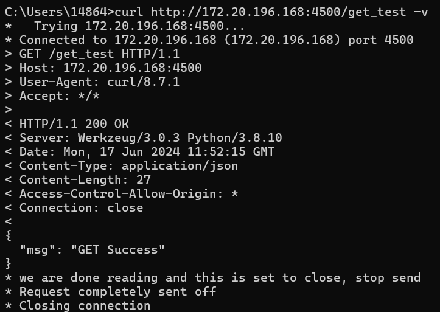

`curl` 程序的输出中，`>` 开头的行表示 HTTP 请求，`<` 开头的行表示 HTTP 应答。

从上面的输出我们可以看到，我们得到的结果符合预期，与程序中写的相同。

我们向目标主机（`172.20.196.168`）的 `4500` 端口发送了该请求。这和上面 TCP 报文的内容是相同的。

同样地，HTTP 应答中，`Connection: close` 表示该连接会被关闭，结合上面 TCP 协议部分的分析，目标主机确实在发送应答的同时发送了 `FIN` 准备关闭 TCP 连接。

接下来我们分析 HTTP 报文的具体内容。

对于 HTTP 请求，第一行为**请求行**，由请求方法（`GET`）、请求路径（`/get_test`）和 HTTP 版本（`HTTP/1.1`）组成

接下来一行一个请求头，由字段名称、冒号、字段值组成。

注意请求头结束后有一个空行。

后面是可选的请求体。因为 `GET` 请求没有请求体，所以这里什么也没有。

对于 HTTP 应答，响应行由协议版本（`HTTP/1.1`）、状态码（`200`）和状态码描述（`Success`）组成。

接下来一行一个响应头，由字段名称、冒号、字段值组成。

注意响应头结束后有一个空行。

响应头之后是响应体，这里是服务器回传的 JSON 格式数据 `{ "msg": "GET Success" }`

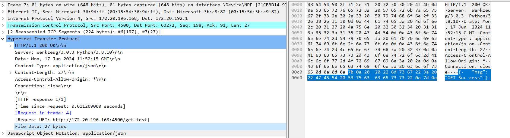

